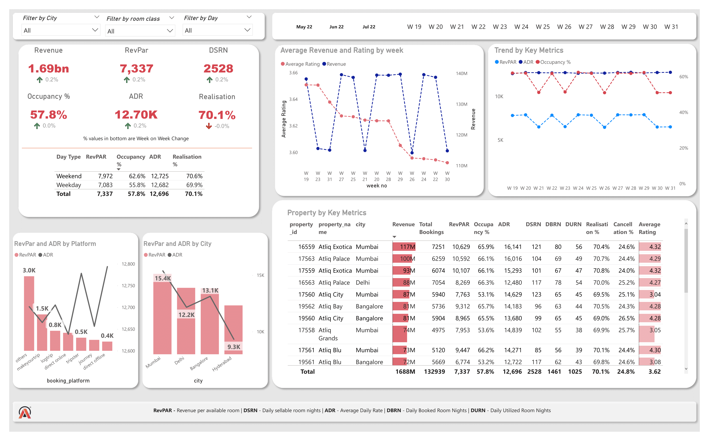

# Revenue Insights Dashboard  
A Power BI dashboard to track and visualize KPIs in the hospitality domain.

This project analyzes hotel performance metrics and visualizes key insights using **Power BI**. It provides an interactive view of revenue, occupancy, and booking trends across multiple cities.  

## Features
- 📊 **Key Metrics Analysis**: Revenue, RevPAR (Revenue per Available Room), ADR (Average Daily Rate), Occupancy %, and Cancellation %.  
- 📈 **Trend Visualization**: Weekly trends for RevPAR, ADR, and occupancy across different cities and booking platforms.  
- 🏨 **Day Type Comparison**: Performance differences between weekdays and weekends.  
- 🎛 **Filtering Options**: Users can filter by room class, city, and day type.  

## Data Processing  
- The dataset was **cleaned and structured in SQL** before being visualized in Power BI.  

## Tech Stack  
- **🛠 Data Processing**: SQL  
- **📊 Visualization**: Power BI  

## Usage  
The dashboard allows users to interactively filter and explore revenue insights across multiple dimensions, aiding in data-driven decision-making.  

---